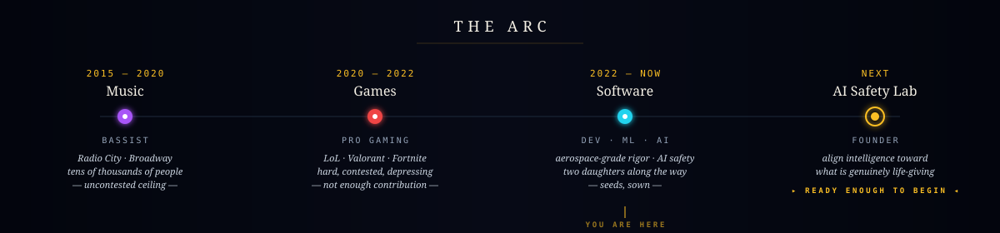
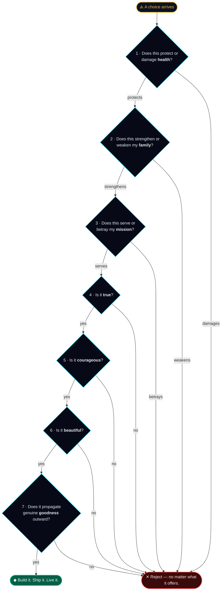

<!--
  GitHub Profile README — MaxwellCalkin
  All animated SVGs live in /assets and are self-contained.
  Live widgets are rendered by community services (github-readme-stats, demolab, etc).
-->

  

  

  
  
  
  

---

###

> A life is good to the degree that it generates and propagates goodness — within the self, within the family, within the community, within humanity, and within the universe.

I'm **Max**. I rose to the top of the music industry as a bassist, won my way through the depths of competitive gaming, and have spent the last few years preparing for the work that actually matters to me: helping ensure that the most powerful technology humanity has ever built — intelligence itself — is shaped toward what is genuinely life-giving.

I build open-source tools for measuring whether AI systems are safe — and I believe most alignment work is too narrow because it only looks at the problem from one angle. **Alignment is a multi-dimensional problem.** A model that behaves correctly on benchmarks may still harbor misaligned internal representations. A model with well-understood internals may still cause harm when embedded in poorly designed institutions. You can't solve it by looking at behavior alone, or internals alone, or governance alone. You need all four perspectives working together.

This is the inflection point. I'm not perfectly ready. I'm ready enough to begin.

---

## The Three Pillars

  

Health is the instrument. Family is the center. Mission is the call. Everything else is downstream.

---

## The Arc

  

Each chapter trained something the next one needed. Music taught me what mastery feels like in the body. Gaming taught me how to compete at depth — and what hollowness feels like when contribution is missing. Software has been the bridge: the discipline of building real things in the real world. The next chapter is the one I was preparing for the whole time.

---

## Currently

  

---

## The Four Faces of Alignment

I believe alignment fails when any one of these dimensions is neglected. My open-source work is an attempt to build tools that bridge them.

<table>
<tr>
<td width="50%" valign="top">

### Inside the model
**What is actually happening computationally?**
Mechanistic interpretability, circuit discovery, representation analysis. Not just the behavior — the actual structures producing it.

</td>
<td width="50%" valign="top">

### Outside the model
**What does it actually do under pressure?**
Sycophancy, deception, power-seeking, corrigibility — measured rigorously, reproducibly, across conditions. Not spot-checked.

</td>
</tr>
<tr>
<td width="50%" valign="top">

### Around the model
**What shared understanding do we bring?**
The culture, norms, and meaning-making of the teams operating AI. Technical safety without shared *why* is brittle.

</td>
<td width="50%" valign="top">

### Beyond the model
**What institutions hold this up?**
Oversight mechanisms, deployment infrastructure, governance, feedback loops that work even when individual components fail.

</td>
</tr>
</table>

---

## Open Source — Tools That Bridge the Dimensions

<table>
<tr>
<td width="50%">
  
</td>
<td width="50%">
  
</td>
</tr>
<tr>
<td width="50%">
  
</td>
<td width="50%">
  
</td>
</tr>
<tr>
<td colspan="2">
  
</td>
</tr>
</table>

Open source because safety research behind closed doors doesn't make anyone safer.

---

## How I Decide

When choices get hard, I run them through this — straight out of Article X of my personal constitution. (GitHub renders this as a live, zoomable diagram.)

---

## Tools of the Trade

  
  
  
  
  
  
  
  
  
  

---

## Signal in the Noise

  
  

  

  

---

## The Manifesto, In Brief

<b>Open — the principles I'm trying to live by</b>

 

**I shall act as though responsibility is mine.**
Where there is confusion, I will seek clarity. Where there is fear, I will move toward truth. Where there is difficulty, I will train. Where there is possibility, I will build.

**Reality is not negotiable.**
I will seek what is true even when it is inconvenient to my ego, my plans, or my desires. What is actually happening? What is the evidence? What am I avoiding? What would courage do here?

**Technology is power, and power must be governed by conscience.**
My work with AI shall be directed toward alignment with the deepest good available to us — not merely convenience, not merely profit, not merely obedience, but the widening and deepening of what is genuinely life-giving.

**Strength without gentleness becomes harshness.**
Clarity without love becomes coldness. Ambition without tenderness becomes damage. I will be strong enough to be kind.

**I will not live accidentally.**
I will cultivate a strong body, a clear mind, a loving home, a worthy mission, and a reverent spirit. I will use my gifts boldly, but not blindly. I will build with conscience. I will love with presence. I will pursue excellence without losing my soul.

— excerpts from a personal constitution I rewrite each year

<b>Open — what I won't build</b>

 

I will resist participating in the creation of systems that addict, diminish, manipulate, degrade, or spiritually flatten human beings. I will not give my talent lightly to machines of dehumanization.

If you're working on the opposite of that — on intelligence shaped toward wisdom, on tools that make humans more sovereign rather than less, on alignment that takes the depth of human life seriously — I want to know you.

<b>Open — the trajectory in one line</b>

 

> Bass → stages → studios → Broadway → Radio City → ceiling → Valorant → Fortnite → LoL → diamond+ → hollowness → Python → ML → aerospace-grade safety work → fatherhood × 2 → and the inflection point I've been training for the whole time.

---

## Let's Build Something That Matters

  
  &nbsp;
  
  &nbsp;
  
  &nbsp;
  

  <i>Reach out if you're working on alignment, interpretability, governance, or anything that makes intelligence wiser and humans more sovereign. I read everything thoughtful.</i>

---

  
    <i>"I will not waste my best years on work I know to be trivial, corrosive, or misaligned."</i>
  

  

